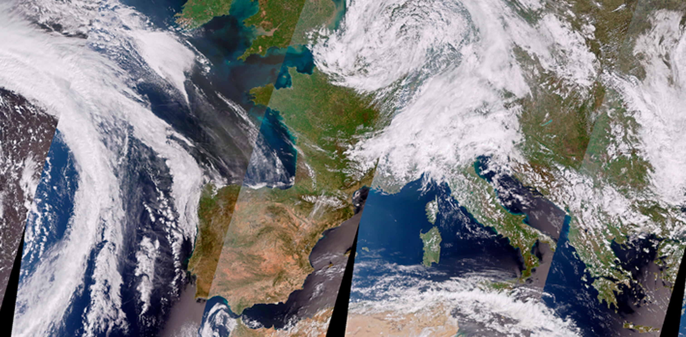

Hi there, I'm Simon, a PhD Researcher in Artificial Intelligence for Remote Sensing 👋  

---

## 🔬 Research Focus  
- **Generative AI for Remote Sensing**  
  - Latent and pixel-space Diffusion Models  
  - ControlNet-style conditioning, Classifier-Free Guidance  
  - GAN-based multispectral band synthesis (e.g., NIR-GAN)
  - Segmentation, Object/Instance Detection Models (Mask-RCNN, DeepLab, Unets, etc)
- **Benchmarking & Evaluation**  
  - OpenSR-Test framework (custom metrics for spectral fidelity & hallucination)  
  - Wald-protocol-based SR validation  
- **Downstream Applications**  
  - Flood and Fire extent mapping  
  - Building footprint segmentation  
  - Road surface change detection
 
---

## 🛠 Tech Stack  

**Languages & Frameworks**  
- **Python**: PyTorch, PyTorch Lightning, scikit-learn, OpenCV, PIL, HuggingFace Diffusers, etc.
- **Geospatial Tools**: xarray, STAC, GDAL, rasterio, shapely, QGIS, GEE  
- **MLOps & Tracking**: Weights & Biases, Dataset Standards  
- **Packaging & DevOps**: setuptools, GitHub Actions, Docker, SSH/remote training on multi GPU clusters 

---

## 🌐 Connect  

<!---!

  

-->

<!----->
<!----->
<!----->
<!----->

